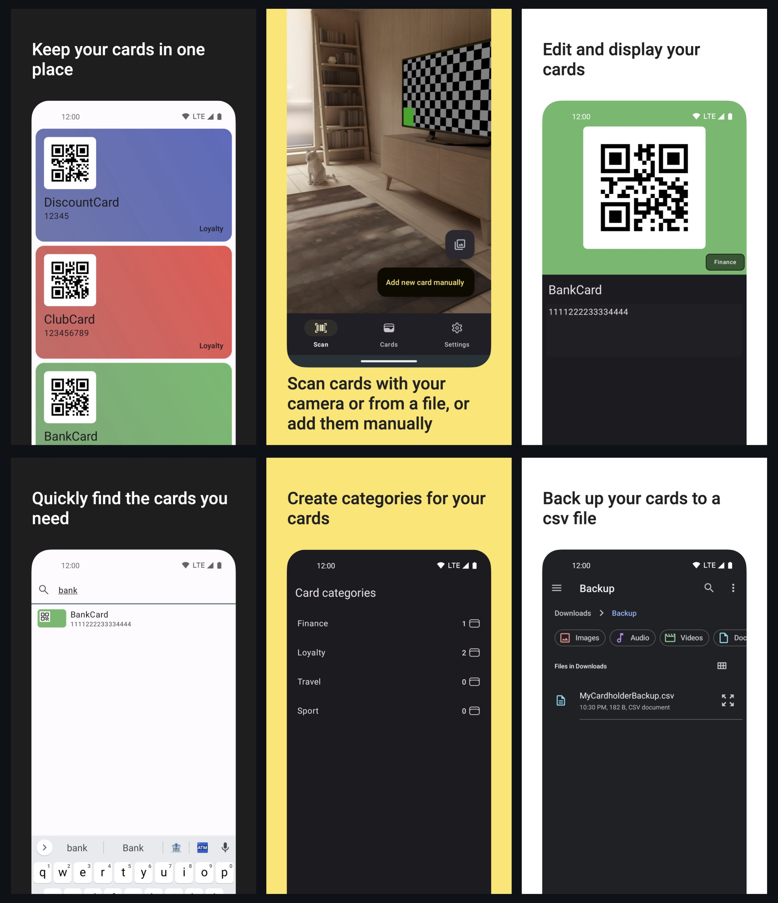
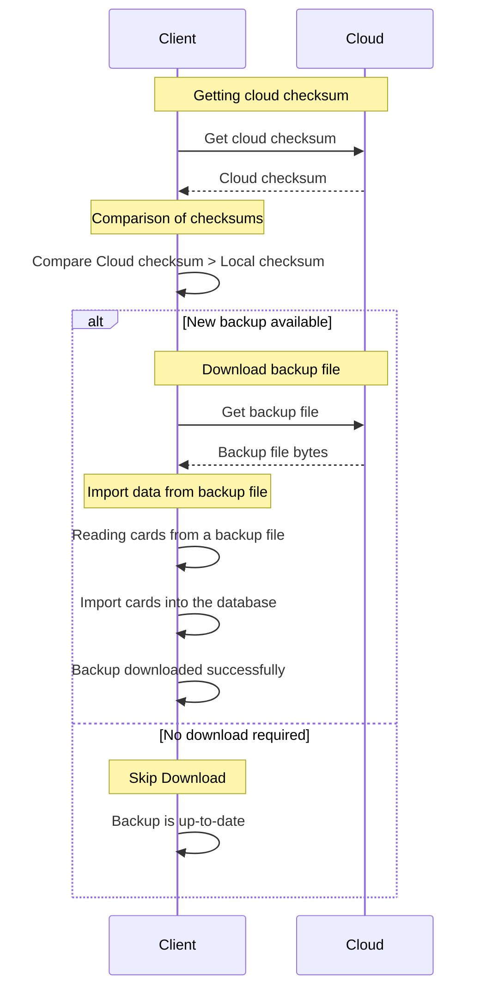
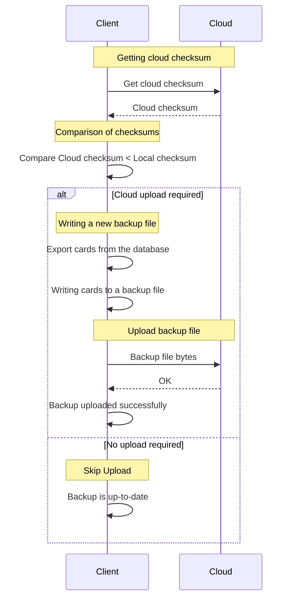

# MyCardholder

An open source cardholder app to store you cards in one place.

## Backup logic

The following terminology is used below:

* **Cloud checksum** - backup file name.
* **Local checksum** - sum of all card timestamps.

### Backup Download

### Backup Upload

## How to build

1. Put `release.keystore` and `release.properties` files to [cert](/cert) folder.
    * `release.keystore` - contains the key used to sign the Android app.
    * `release.properties` - contains the values of the store password, alias, and key password.
2. Run [build-aab.sh](/build-aab.sh) in terminal.

Also, don't forget about the [google-services.json](app/google-services.json) file. It can be found
in the Firebase console:

Download this file and place it in the [app](app) folder of this project.

## Tech-stack

* [Kotlin](https://kotlinlang.org/)
    * [Android KTX](https://developer.android.com/kotlin/ktx) - set of extensions that are included
      with Android Jetpack and other Android libraries
    * [Coroutines](https://developer.android.com/kotlin/coroutines) - recommended solution for
      asynchronous programming on Android
    * [Kotlin Flow](https://developer.android.com/kotlin/flow) - data flow across all app layers,
      including views
* [Firebase](https://firebase.google.com/)
    * [ML Kit's barcode scanning](https://firebase.google.com/docs/ml-kit/read-barcodes)
* [Jetpack](https://developer.android.com/jetpack)
    * [CameraX](https://developer.android.com/jetpack/androidx/releases/camera) - camera
      capabilities
    * [Constraintlayout](https://developer.android.com/jetpack/androidx/releases/constraintlayout) -
      position and size widgets in a flexible way with relative positioning
    * [Hilt](https://developer.android.com/training/dependency-injection/hilt-android) - dependency
      injection
    * [Lifecycle](https://developer.android.com/topic/libraries/architecture/lifecycle) - perform an
      action when lifecycle state changes
    * [Navigation](https://developer.android.com/topic/libraries/architecture/navigation/) - in-app
      navigation
    * [Room](https://developer.android.com/jetpack/androidx/releases/room) - store offline cache
* [Coil](https://github.com/coil-kt/coil) - image loading library
* [ZXing](https://mvnrepository.com/artifact/com.google.zxing/core) - barcode encoding/decoding
  library

## UI

* [View Binding](https://developer.android.com/topic/libraries/view-binding) - retrieve xml view ids
* [Material Design 3](https://m3.material.io/) - application design system providing UI components
* [Dark Theme](https://material.io/develop/android/theming/dark) - dark theme for the app (Android
  10+)
